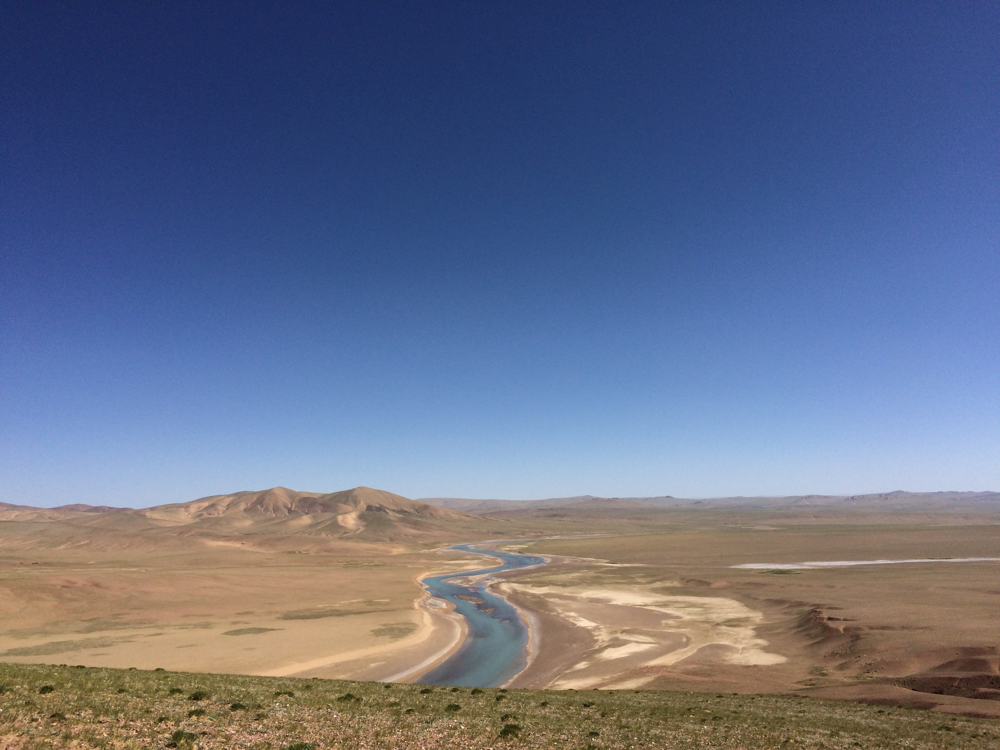

<html>

<meta charset="utf-8">
<meta name="viewport" content="width=device-width, initial-scale=1.0">

<body style="background-image:url(index.jpg);background-repeat: repeat-y;background-size:100% 100%;background-attachment:fixed">

<h1 style="font-family:STCaiyun;color:rgb(38, 0, 255);text-align:center;font-size:100px">Long Long Journey......</h1>
 

用双脚丈量大地..................

<a href="https://weibo.com/boudinage/profile?rightmod=1&wvr=6&mod=personinfo">点击关注我的微博</a>

</body>

</html>

---
# 今天我创建了我的个人博客
我的第一个发言送给美丽的<acronym title="我的主人">小仙女</acronym>！
   

---

我的第二个发言送给美丽的<acronym title="西藏最大的内流河，流入色林错">扎加藏布</acronym>！
    

<address style = "text-align:center">
        Written by Ph.D Yiling Hu.  
        hyl_cugb@163.com 
        Xueyuan Road 29, China University of Geosciences(Beijing) 
        Haidian District, Beijing, China
        </address>
        